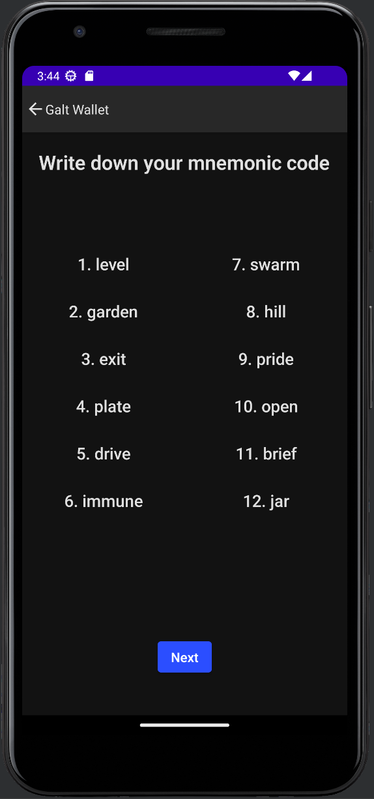
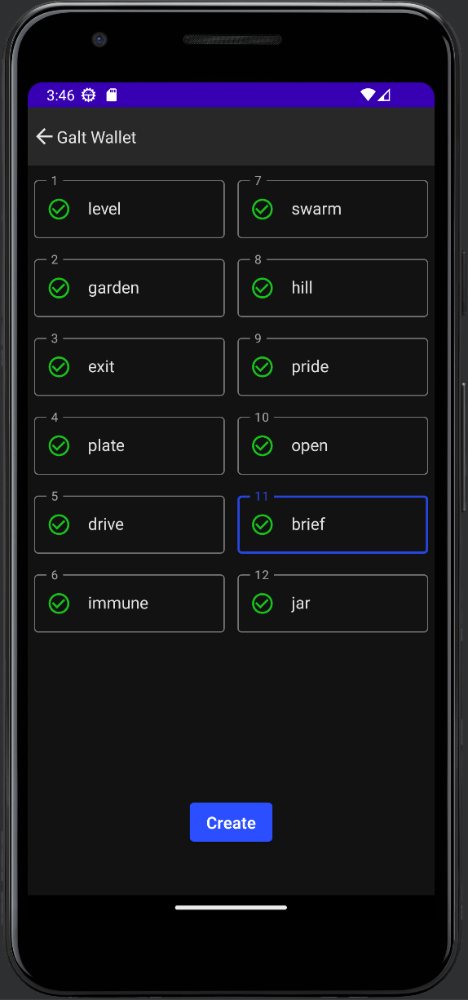
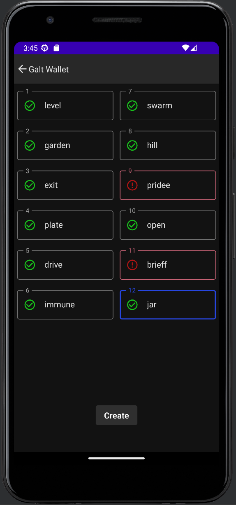
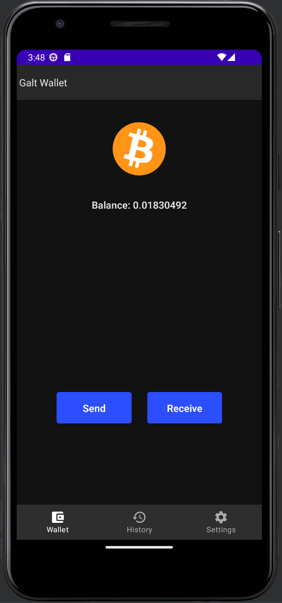
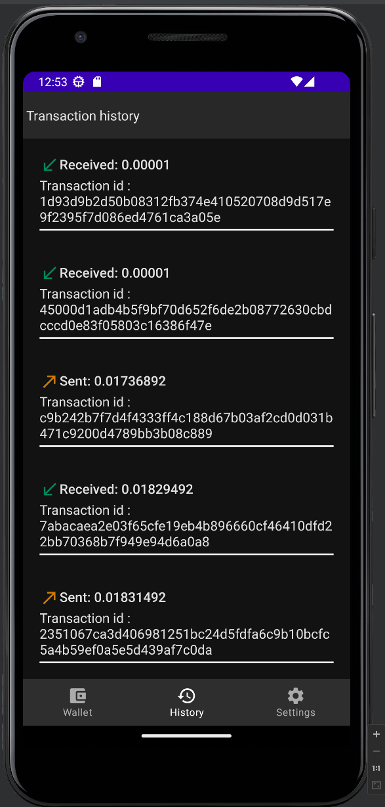
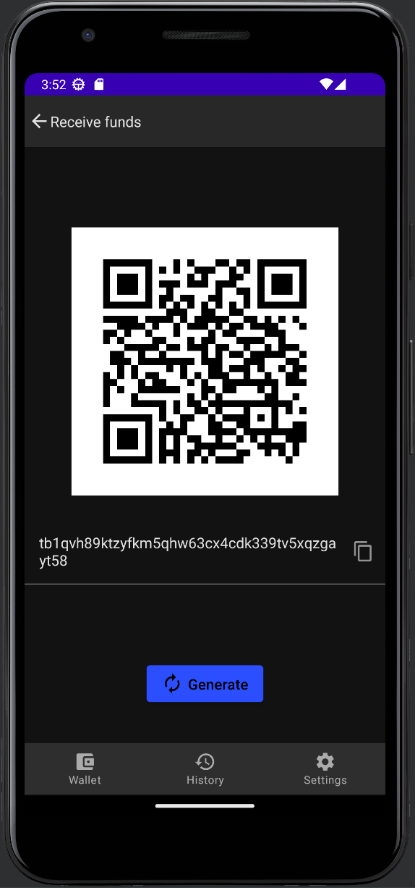
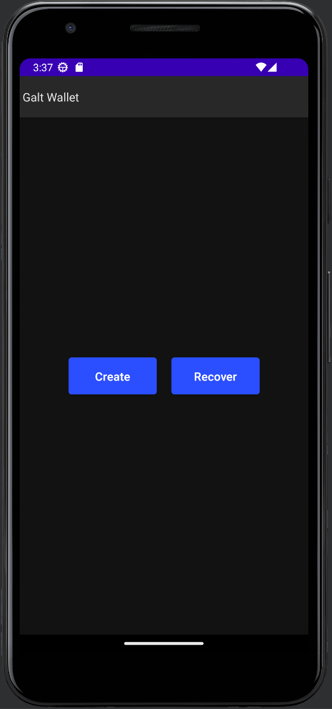
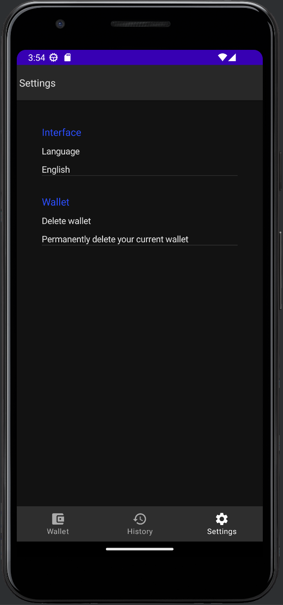

# GaltWallet

Bitcoin android wallet powered by [bdk](https://github.com/bitcoindevkit/bdk) 

This is not a serious project, it only works with testnet but it's totally functional. 
The purpose behind this is see the capabilities of bdk.

## Features

- [x] Send
- [x] Receive
- [x] Transaction history
- [x] Seed generation
- [x] Wallet recovery
- [x] Multilanguage support (English and Spanish)

### Use it

You can run the app with [Android studio](https://developer.android.com/studio)

### Used technologies
- Kotlin
- Jetpack compose
- Hilt
- BDK

### Screenshots

     
     
     

     
     
     

     
     

